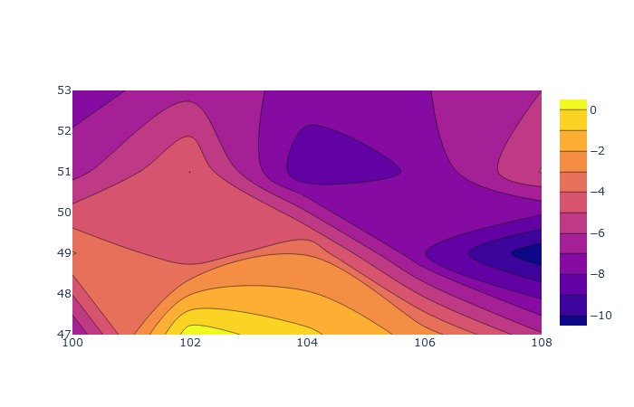

# get_weather
Отображает температуру из openweathermap в графиках plotly.
***
Начало работы:
1. Вводится широта и долгота в int
2. Создаётся матрица 5Х5 с центром с введёнными координатами и шагом в 2°
3. Начинается запрос погоды с openweathermap
4. Строится график распределения температур по координатам в plotly
5. В точках, где нет информации, график достраивается автоматически

